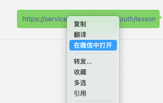
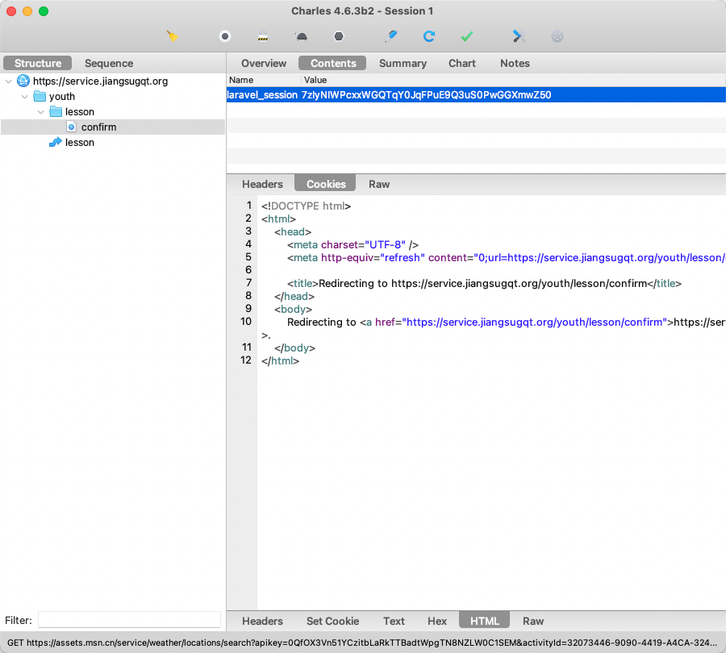

# 江苏省青年大学习自动学习Python脚本

### 实现原理

对于这种功能一般都和网络请求相关了，简单来说就是带着你的信息去发送请求即可。

### 运行

`main.py` 脚本：

- 使用 Charles 进行抓包。Charles 的安装与配置可以参考：（配置好PC端的抓包即可，需配置SSL证书）
  - macOS：https://juejin.cn/post/6844903733478817800
  - Windows：https://www.jianshu.com/p/2abc38187683
- 启动 Charles 抓包。
- 在电脑版微信中访问青年大学习，或使用微信打开链接：https://service.jiangsugqt.org/youth/lesson （如下）
  
- 选中 Host 为 service.jiangsugqt.org 中的请求，点击 Contents - Cookies ，记录名为 laravel_session 的 cookie。
  
- 将上一步记录的 laravel_session 作为命令行参数传入 `main.py` 脚本即可。

`server.py` 脚本：

- 原理与上述方法相同，唯一的区别是 GET `http://host:port/session/{laravel_session}` 来传入 laravel_session 。 
- 提供一个在线服务平台：http://qndxx.holgerbest.top:5555

### 创作不易 希望能得到您一颗小星星⭐️ 十分感谢

Thanks:  [yuzaii/JsQndxx_Python](https://github.com/yuzaii/JsQndxx_Python) 

TODO List:

- [ ] 添加定时任务功能
- [x] iOS版快捷指令：https://www.icloud.com/shortcuts/3d10902f9ebb4b4bb520df301a9912a1
